# Gymshark Exercise Library

## Description
#### Brief
The main goal is to produce a web application demonstrating understanding in some of the core elements in front end engineering. 
Given an API endpoint which returns JSON data the application should present a list of exercises including an image and exercise title. Selecting each exercise will then show information about the exercise.
The user should be able to toggle between genders on screen to update the image used.
I have full creative control over how the app looks and feels and the choice to use any JavaScript framework or application setup. The application must be web based and must run in a browser via a URL.

#### Decisions
1.	JavaScript framework – I have used Create-React-App, as the team at Gymshark primarily develop frontend components in React. This way I can demonstrate my understanding of the react function and mindset. 
2.	Design – I have added in a few components of my own design however I have mostly looked to the various Gymshark applications both mobile and website to integrate my design with their branding and make my application look like it belongs with the brand. 

#### Why my project stands out
I have aimed to demonstrate the major core skills of a front-end engineer by creating the MVP outlined in the brief and further developing the website to encompass more of these techniques giving the application a rich user interface and full experience. The application is also fully responsive so the user can take the application with them. 
I have paid good attention to detail and ensured that the website functions correctly and intuitively for the user. 
I will outline the skills later in the documentation. 

#### [Exercise Library](https://samwakelam.github.io/GYM-SHARK-SLW/#/)

## Contents
- [User story](#user-story)
- [Technologies](#technologies)
- [Project dependencies](#project-dependencies)
- [Development](#development)
- [Features](#features)
- [Further development](#furthr-development)
- [Updates](#updates)
- [License](#license)


## User Story : 
**AS:** a user wanting to improve their strength and conditioning skills and core fitness…

**I WANT:** An application to show what exercises I can complete targeting specific body areas and muscle groups…

**TO:** Keep my workout routine fresh and interesting with new exercises. 

## Technologies
The technologies that I have used are:
- HTML 
- CSS with media queries
- JavaScript
- Node with npm packages 
- React with create-react-app

## Project Dependencies 
Project dependencies and packages used are: 
- Font awesome
- Animate.css
- Gh-pages for deployment
- React with create-react-app
- React-animate-on-scroll
- React-dom
- React-router-dom
- React-html-parser
- React-lazyload
- React-responsive

## Development
If you wish to develop this application or run the application from your server / computer: 
In the project root:
#### Install Dependencies:
`npm install`
#### Run Tests:
`npm run test`
#### Build the component:
`npm run build`
#### Run the Demo project:
`npm start`
#### Deploy the project to GH-pages
Open your `package.json `and add a `homepage field` for your project:
`  "homepage": "https://myusername.github.io/my-app",`
Install gh-pages and add deploy to scripts in `package.json`
` npm install --save gh-pages`
Add the following scripts in your `package.json`:
```
  "scripts": {
+   "predeploy": "npm run build",
+   "deploy": "gh-pages -d build",
    "start": "react-scripts start",
    "build": "react-scripts build",
```
Then deploy the site: 
`npm run deploy`

## Features 
#### Home Page 


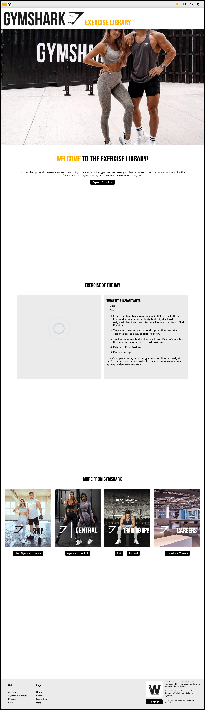
screenshots do not display parallax or fixed background effects. 

The Home Page displays a number of skills for front end development engineering.

* The background of the page includes parallax scroll which uses the `background-attachment: fixed` css property and media queries to detect screen orientation. The images change for more appropriate orientated images to combat the `background-size: cover` property in the parallax effect.

* I have included navigation links for easy and demanding UI, the welcome titles display a navigation button directly to the exercises page. For this I utilise the `NavLink` feature from `react-router-dom` which detects if a page/ link is active once selected.

* Exercise of the day demonstrates skills in data sorting and retrieval. Taking the array of exercise objects and using Math.random() to choose an index number. This also utilises the Local storage to store the date and exercise of the user, recognising when the day changes and preventing a new exercise selection on page recall or refresh. 

* More from Gymshark section demonstrates links to external sources and the `target` property to open in a new tab. 

---

#### Exercises Page

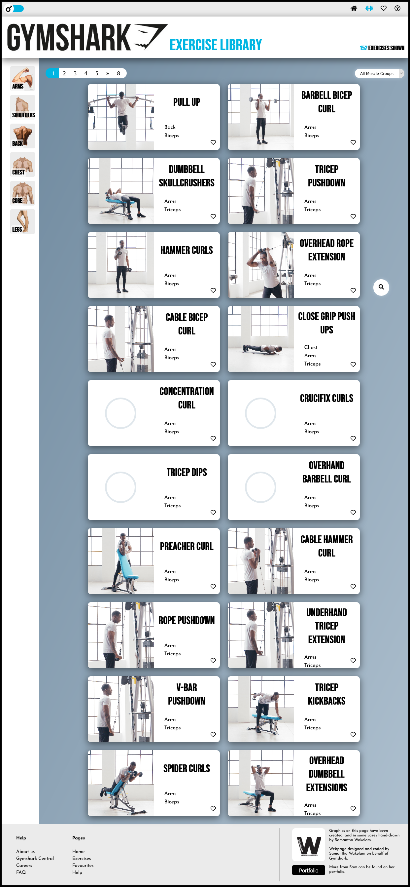
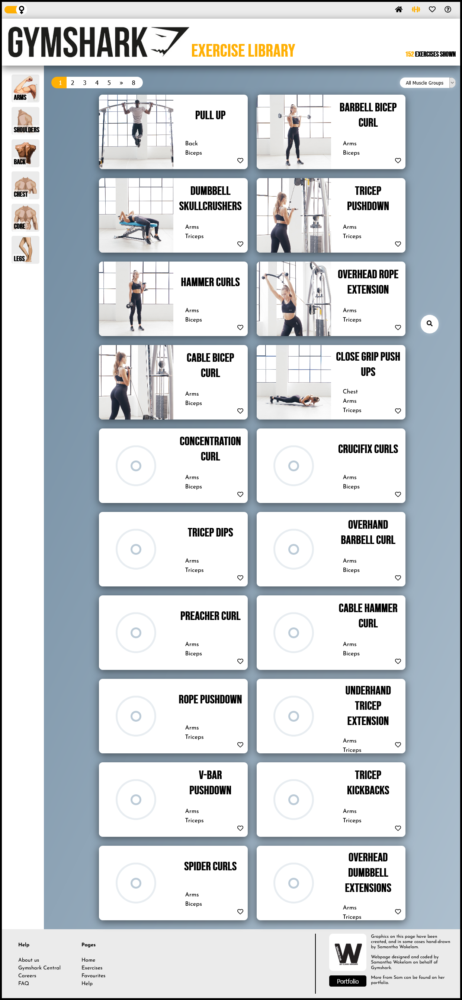

The Exercises Page displays a number of skills for front end development engineering.

* The navigation tab to the left shows uses of `React-router-dom` and` animation` to select and route to a new page, this is beneficial to the user as it makes it book-markable for future access. This utilises the `component render` feature in` react-router-dom` to pass props to and from the rendered component. 

* These pages make use of reacts build feature, using one component to render different, specified information for each page. 

* The data can be refined on each page using the muscle group `select` element which in turn uses conditional rendering to show the available muscle groups in the selected page.

* The page also includes Pagination feature built in react to detect a page limit for the exercises and display a specified number of pages. 

* This page heavily displays different techniques to receive `API` data and manipulate and sort the information in an array of objects to display the desired information. 

* The images in the cards display the use of Lazy loading to improve deliverability to the user without the need to wait for the images before rendering the page.

---

#### Cards

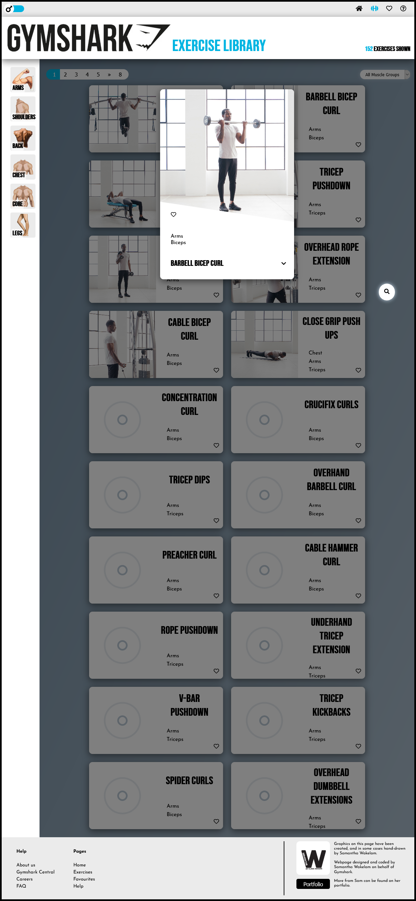
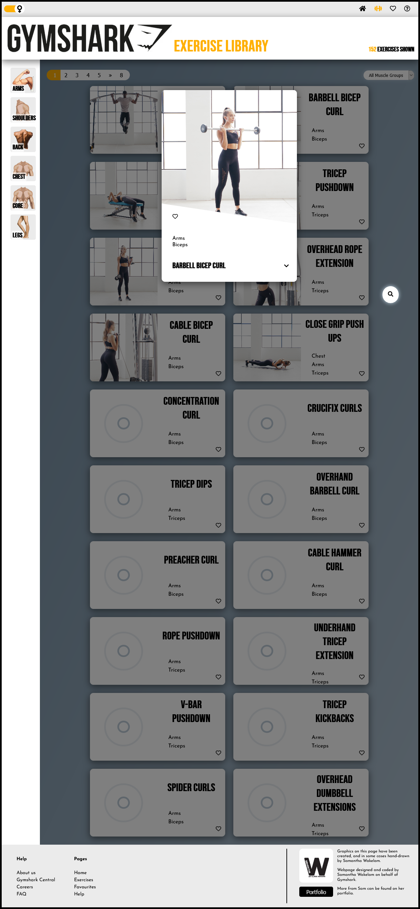

* The large exercise cards demonstrate the use of the `useRef` hook in react to detect which preview card was selected and its location, enabling it to open in view of the user without the need to scroll back to the top. 

---

#### Favourites Page 

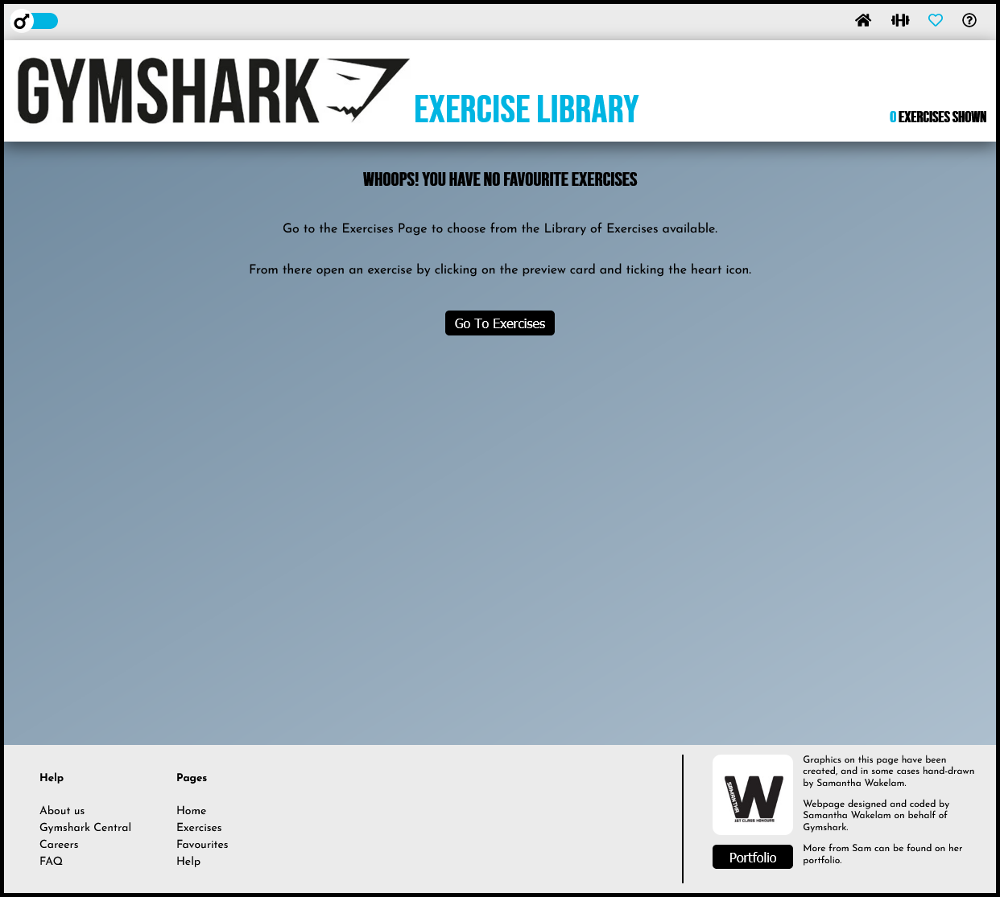
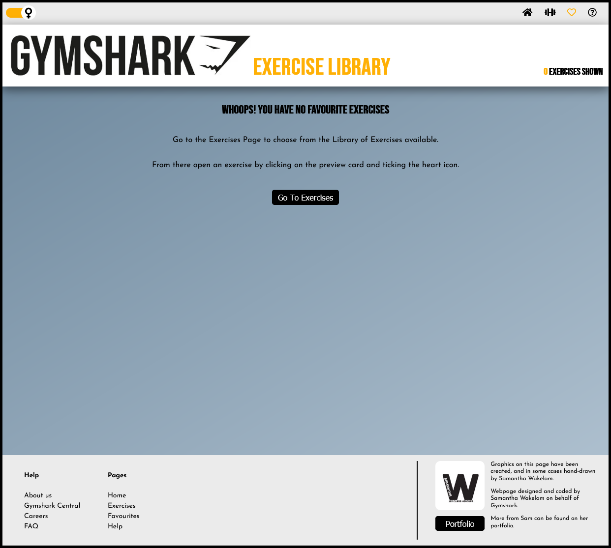


The Favourites Page displays a number of skills for front end development engineering.

* This page utilises the local storage feature to retrieve basic saved information from persistent storage and filter array and object information from the `API` to display the requested data for the front-end application.  

---

#### Help Page

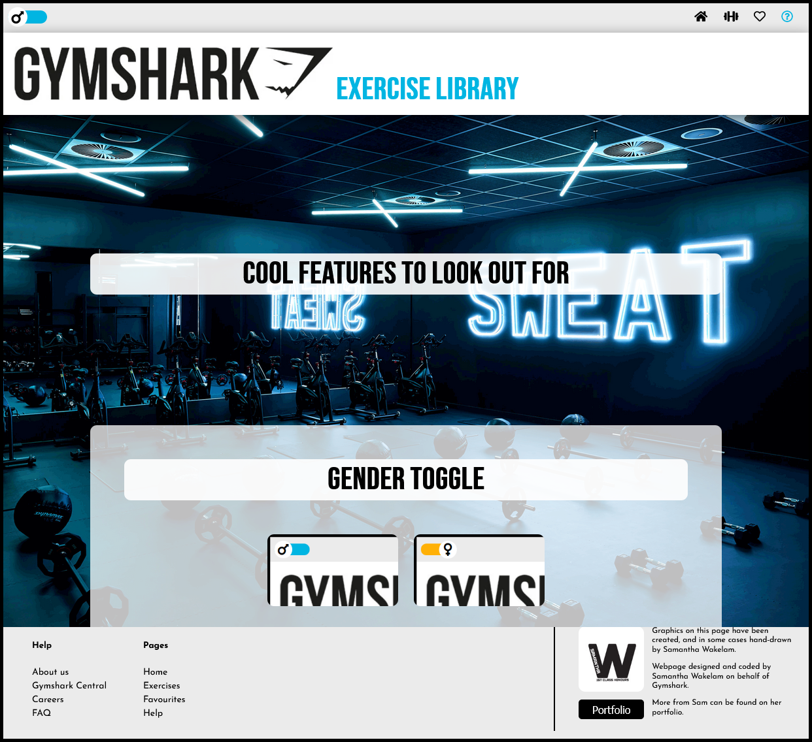
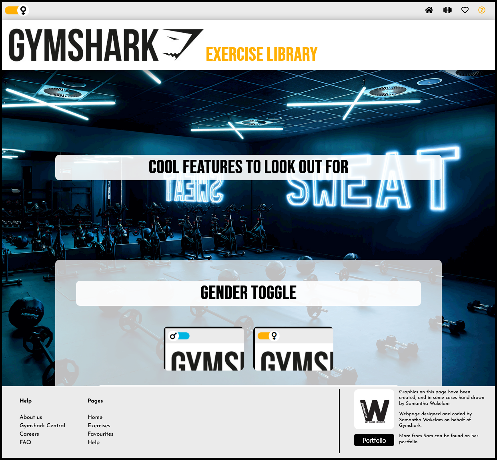

The Help Page displays a number of skills for front end development engineering.

* The background uses a fixed `background-attachment` to keep the background image in place as the user scrolls. 

* This page shows use of a third-party package for animation on scroll, allowing the help sections to fade in and out as requested by the browser page. 

---

#### All Pages

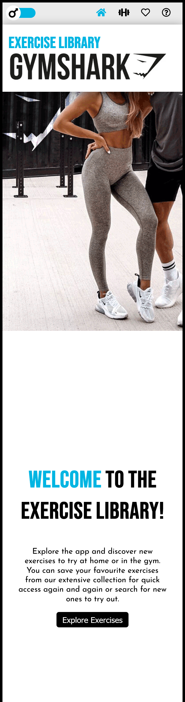
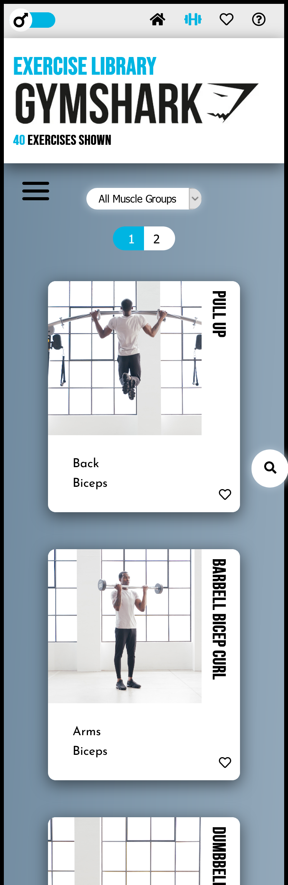
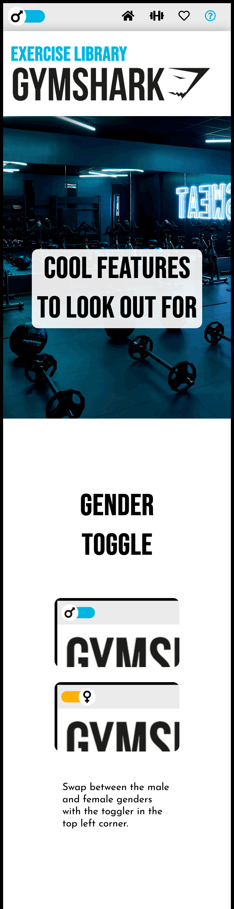

Screenshots do not display fixed background styles and paralax effects. 

* All pages use CSS flexbox and grid to arrange the elements and have full responsive capabilities utilising media queries in CSS and through `npm package react-responsive`. To ustilise react-responsive I have demonstrated the use of `useContext` hook in react to access the properties and break points set across the whole site. 

* Each page has access to the gender toggle which also demonstrates the `useContext` to tell all pages which gender has been selected. I have used this information through the application to highlight key elements and effects with gender specific colouration. 

* I have demonstrated understanding of enviroment variables by hiding the API route in a dotenv file. 

---

## Further Development
To improve the website: 

* The favourites feature needs to automatically update the preview cards once toggled in the larger Exercise card. 

* In favourites page I would like to include the use of react-dnd (drag and drop) to select a top 3 exercise or create a small 3 – 5 exercise workout list. 

* While the site links through to the Gymshark training application, a page to save workouts would be beneficial and the features across the website to enable this. 

## Updates
There are no updates at this time. Application created (07.04.2021)


## License

Licensed under the [MIT License](https://choosealicense.com/licenses/mit/). 

A short and simple permissive license with conditions only requiring preservation of copyright and license notices. Licensed works, modifications, and larger works may be distributed under different terms and without source code.  

.

Graphics have been drawn by Samantha Wakelam and must have express permision to reuse under copyright. 

Photographs for the website belongs to Gymshark and have prior permissions to use. Pemission to reuse must be obtained. 
